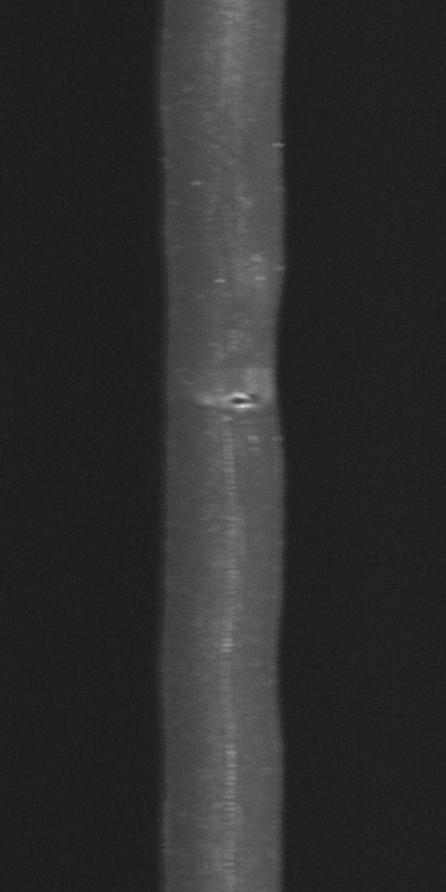
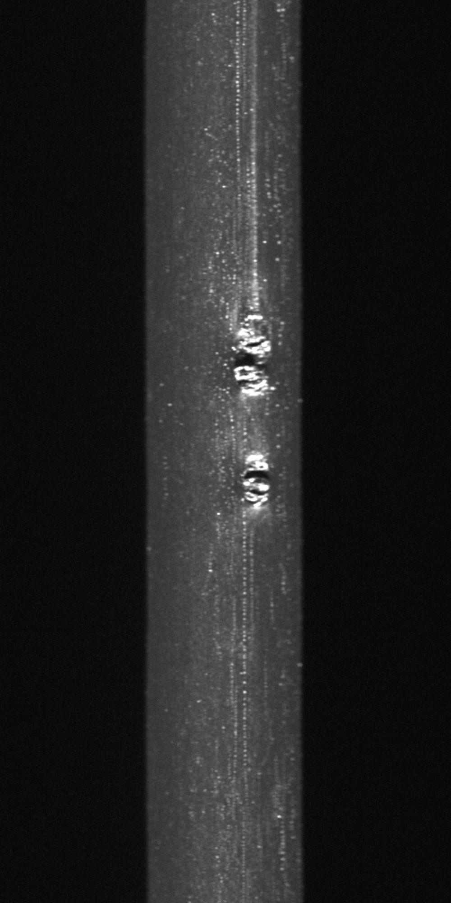
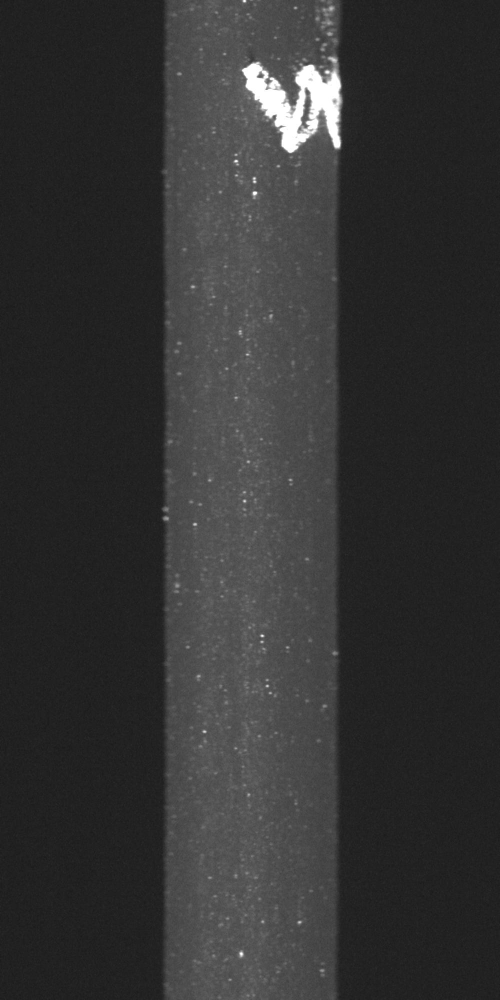
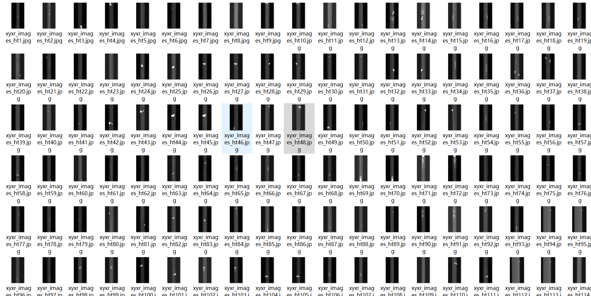

# Conveyor Belt Defect Detection Dataset 8205 imagesVOC+YOLO format

The defect detection dataset of the conveyor belt, 8205 VOC+YOLO format

Dataset format: Pascal VOC format + YOLO format (the txt file does not contain the split path, it only contains jpg images and corresponding VOC format xml files and yolo format txt files)

Number of images (total number of jpg files): 8205

Number of XML Files: 8,205

Number of txt files: 8205

Number of categories: 7

The Github repository is: datasets_sl

["0-water", "1-hole", "2-big defect", "3-small defect", "4-big non-defect", "5-small non-defect", "6-print"]

Tag Chinese Comparison: "0-Water," "1-Holes," "2-Major Defects," "3-Minor Defects," "4-Major Non-Defects," "5-Minor Non-Defects," "6-Printing"

Number of boxes labeled in each category:

The number of water frames is 15805.

The number of 1-hole frames is $204$.

2-big defect frame count = 680

3-small defect frame count = 892

4-big non-defect frame count = 588

The English translation of the Chinese text is "5 - Small Non-Defective Frame Count = 3788".

6-print frame count = 17406

Total frames: 39363

Number of images per category:

0-water occupies a picture number = 1281

The number of pictures with 1-hole occupation = 191

2-big defect occupies the number of images = 591

3-small defect occupies 878 pictures

4-big non-defect occupies the number of pictures = 344

5-small non-defect annotated images = 1524

6-printing occupies 3935

Image resolution: Multi-resolution images, such as 500x2000, 1000x2000, etc.

Use the labeling tool: labelImg

Dataset Augmentation: No

Rules for annotation: Draw a rectangle around the category.

Important note: The dataset does not have been divided into training, validation, and testing sets.

Special Disclaimer: This dataset does not guarantee the accuracy of the trained models or weight files.

Annotation and image details are as follows:

## Images

---

Here is a pay link on Stripe (https://buy.stripe.com/3cs8yP7sY87d0vu9AB). Please contact me lonlonago@foxmail.com after funding $89, and I will send you a complete data files, thank you!

